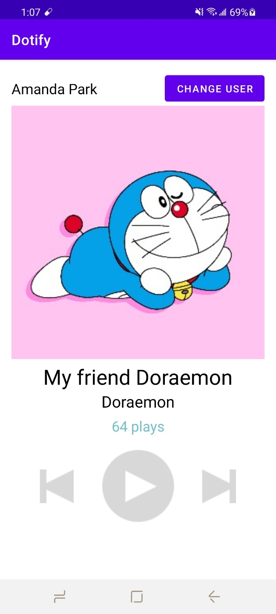

# Dotify
# Your App by Amanda Park
# App Description
This is a music app like Spotify
1. A user can play click prev, play and next btn
2. User can change username 
3. User can see the number of play 
4. User can change the textcolor of number of music played by holding the photo long

## Extra credit
I have completed the following 

1. A user is not allowed to apply a new username if the edit text field is empty. (+ 0.25)
2. Long pressing on the cover image changes the text color of the play count to a different color. (+ 0.25)
3. If using ConstraintLayout, utilize a Barrier or Guideline somewhere with a view constrained to it (+0.25)
4. All hardcoded dimensions & colors are extracted into res/values/dimens.xml & res/values/colors.xml
respectively (+ .5)

## Screenshots

